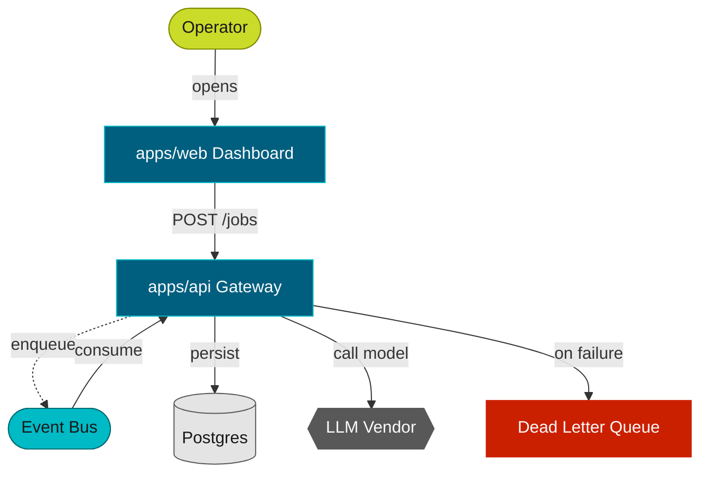

# Mermaid conventions (proveo)

Reach for Mermaid when a flow / state / topology diagram should render **inline** — in GitHub, IDE
previewers, and Markdown — without a build step. For richer architecture/deployment/sequence work, or
anything that must be validated and rendered to a versioned SVG, prefer PlantUML (`plantuml.md`).

## Theme

Mermaid has no remote include, so the theme is **vendored** into `_spec/themes/proveo.mermaid` (run
`scripts/fetch-themes.sh`). It is a `%%{init}%%` block that maps the proveo palette onto Mermaid's
theme variables. Prepend that block to the top of each `.mmd` file (above the diagram declaration),
then attach role classes to nodes.

The block also ships the six role `classDef`s mirroring the PlantUML stereotypes:

```
classDef app   fill:#005F7F,stroke:#00BAC6,color:#FAFAFA;
classDef async fill:#00BAC6,stroke:#006B70,color:#181818;
classDef host  fill:#CBDB2A,stroke:#818D00,color:#181818;
classDef cloud fill:#585858,stroke:#585858,color:#FAFAFA;
classDef db    fill:#E5E4E4,stroke:#585858,color:#181818;
classDef error fill:#CB2000,stroke:#CB2000,color:#FAFAFA;
```

> Note: the shipped `classDef` palette assigns `app`→teal, `async`→cyan, `host`→lime — the same six
> brand colors as PlantUML, with `async`/`host` swapped between cyan and lime. Use the class names by
> **role** (the name is the contract), and keep them consistent within a diagram.

## Roles → node syntax

Tag every node with a role class via `:::class`. Pair the role with a shape that reads at a glance:

| Role | Class | Suggested shape | Example |
| --- | --- | --- | --- |
| first-party app/service | `:::app` | rectangle `[...]` | `WEB[apps/web Dashboard]:::app` |
| queue / event / async | `:::async` | stadium `([...])` | `BUS([Event Bus]):::async` |
| host / operator | `:::host` | stadium `([...])` | `OP([Operator]):::host` |
| external / vendor | `:::cloud` | hexagon `{{...}}` | `LLM{{LLM Vendor}}:::cloud` |
| persistence | `:::db` | cylinder `[(...)]` | `PG[(Postgres)]:::db` |
| failure / dead path | `:::error` | rectangle `[...]` | `DLQ[Dead Letter Queue]:::error` |

## Arrows

Mermaid carries less edge semantics than PlantUML's `ARROW_*` macros, so lean on solid vs dotted and
clear labels:

- `-->|label|` — primary / synchronous path.
- `-.->|label|` — async / optional / supporting edge.

## Full example



(The `classDef` lines and the `%%{init}%%` block both come from `_spec/themes/proveo.mermaid` — copy
the whole file's content in, or keep the file as the canonical source and paste the block per diagram.)

## Rendering

Mermaid renders inline almost everywhere, so a CLI is only needed for static export. See
`rendering.md` for `mmdc` install and the headless-Chromium notes.
