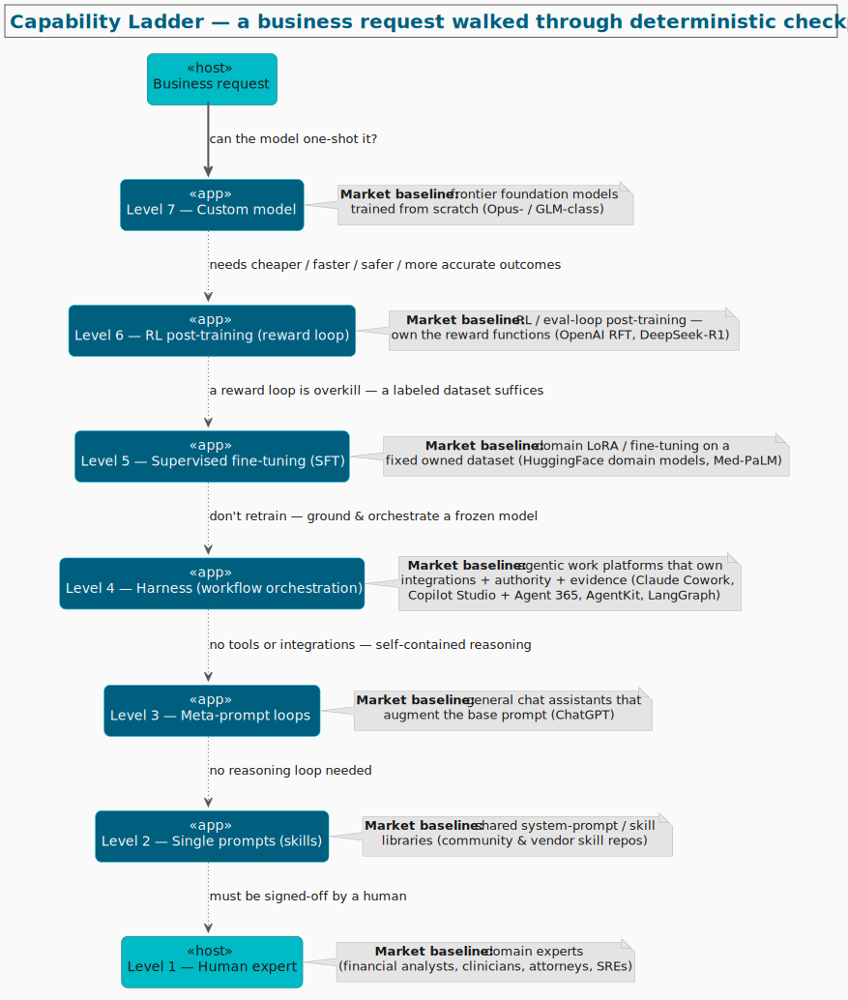
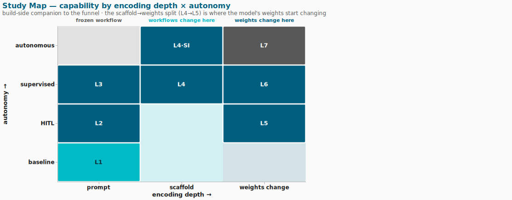

# Study-cases — the capability ladder

The study-cases learning surface maps how agent/LLM systems are built. Its organizing axis is a
**7-level capability ladder** for deciding *at what level a business request should be solved*. Two
views share the same seven tiers:

- **The funnel (demand-side)** — how business needs force a *supplier* down from the aspirational top
  (a custom model) to whatever rung actually clears the bar. A decision procedure.
- **The study map (build-side)** — the same tiers on a 2D plane: *encoding depth* (prompt → scaffold →
  weights) × *autonomy* (baseline → HITL → supervised → autonomous). A learning map.

> **Layout.** The tree is organized **by level**: top-level `N-name/` dirs, with topic subfolders
> inside the large `4-harness/` tier (`governance/`, `evidence-and-durability/`,
> `meta-orchestration/`, `self-improving/`, `applied/`, plus the migrated `anti-framework/` and
> `framework/`), and `_substrate/` for substrate that's orthogonal to the ladder. Cross-cutting
> overviews (`summary.md`, `_essentials.puml`, `context-and-retrieval.md`) stay at the root; the two
> ladder diagrams live in [`../overview/`](../overview/). Each file also declares its tier in a
> `' Level:` header (see [`../CONTRIBUTING.md`](../CONTRIBUTING.md)).

## The funnel (demand-side)

Read top-down. Start by asking whether the most capable, most-owned approach can one-shot the request;
at each **deterministic checkpoint**, the named shortfall pushes you down one level, until a level
clears the bar — or you hit the human floor.

*Diagram source: [`business-needs-funnel.puml`](../overview/business-needs-funnel.puml) — render with `plantuml -tsvg`.*

## The study map (build-side)

A 2D plane: **encoding depth** on X (prompt → scaffold → weights) × **autonomy** on Y — **baseline**
(human runs it) → **HITL** (per-step human approval) → **supervised** (human oversees) → **autonomous**
(unattended). Tiers cluster along depth — autonomy is the orthogonal dial: the same depth can sit at
different autonomy (L4 supervised vs L4·SI autonomous share the scaffold column). What you **edit
deepens** left→right: the **prompt** (workflow frozen) → the **workflow** at L4 (tools, orchestration;
weights still frozen) → the **weights** at L5+. The decisive line is **L4 → L5** — where you first
change the *weights*.

*Diagram source: [`study-map.vega.json`](../overview/study-map.vega.json) — render with `vl2svg study-map.vega.json study-map.svg` (theme: `_spec/themes/proveo.vega.json`).*

## The levels

| Level | Name | What it is | Generic market baseline | Boundary below it | Dir |
| --- | --- | --- | --- | --- | --- |
| **7** | Custom model | Train the neural network from scratch; you own the data and the architecture | Frontier foundation models trained from scratch (Opus- / GLM-class) | _entry: "can the model one-shot it?"_ | — |
| **6** | RL post-training | Update weights against a **reward / eval loop you own** — RLVR, RFT, or SFT on loop-generated data | OpenAI RFT; DeepSeek-R1; Tülu 3 | needs cheaper / faster / safer / more accurate | `6-post-training/` |
| **5** | Supervised fine-tuning | Adapt open weights to a **fixed dataset you own** (LoRA / SFT) | Domain models on HuggingFace; Med-PaLM; FinGPT | a reward loop is overkill — a labeled dataset suffices | `5-fine-tuned/` |
| **4** | Harness (workflow orchestration) | **Ground the model in tools / data / integrations**, own authority + evidence, orchestrate multi-step work — incl. **self-improving harnesses** (frozen weights) | Claude Cowork; Copilot Studio + Agent 365; AgentKit; LangGraph; Devin / Factory (coding) | don't retrain — ground & orchestrate a frozen model | `4-harness/` (`governance/`, `evidence-and-durability/`, `meta-orchestration/`, `self-improving/`, `applied/`, `anti-framework/`, `framework/`) |
| **3** | Meta-prompt loops | Augment the base prompt with reasoning / iteration loops (no tools, no weight change) | General chat assistants that augment the base prompt (ChatGPT) | no tools or integrations — self-contained reasoning | `3-meta-prompt-loops/` (CoT, ReAct, Reflexion, ToT, MAD); much of `context-and-retrieval.md` |
| **2** | Single prompts (skills) | A crafted system prompt / reusable skill, one-shot | Shared system-prompt & skill libraries (community & vendor repos) | single-shot — no reasoning loop needed | _(existing skill libraries; none here yet)_ |
| **1** | Human expert | A person does — or signs off — the work | Domain experts (financial analysts, clinicians, attorneys, SREs) | must be signed-off by a human | — _(the floor)_ |

**L4 → L5 is the frozen→trained line.** Everything at L1–L4 leaves the base model's weights untouched
(you change prompts, tools, orchestration); L5 is where you first change the weights. It's the single
most consequential boundary on the ladder — both diagrams mark it.

**Tools & retrieval grounding** isn't a separate rung — it's the defining capability of **Level 4**
(the "integrations + evidence" in its definition) and the boundary between L4 and L3. **Evaluation**
(rubrics/scores/benchmarks) is the substance of **Level 6** and, more broadly, the cross-cutting signal
that licenses every climb; **authority/HITL** is the study map's Y axis and intensifies upward.

**Orthogonal to the ladder.** Some study-cases describe *deployment / control substrate* rather than a
capability tier — `_substrate/edge-and-p2p/` (on-device inference, P2P transport, embedded servers,
liveness), `_substrate/reactive-control/` (classical `steering-behaviors`, `behavior-trees-and-fsm`),
and the migrated `_substrate/web-llm/` and `_substrate/nets/`. These are tagged
`' Level: n/a (substrate)`.

## Where the focus is

The harness's own projects cluster at **Level 4** (aphelion's authority/evidence, omnigent's
orchestration, plus the frozen-weight self-improvers in `4-harness/self-improving/`) — so `4-harness/`
is the richest tier. **Level 6** (`6-post-training/`) is the deliberately-expanded tier: weight updates
driven by a reward/eval loop. Every study-case is authored as a rendered `.puml` (+ `.svg`) under its
level dir; see [`../CONTRIBUTING.md`](../CONTRIBUTING.md) for the authoring + sourcing rules.
