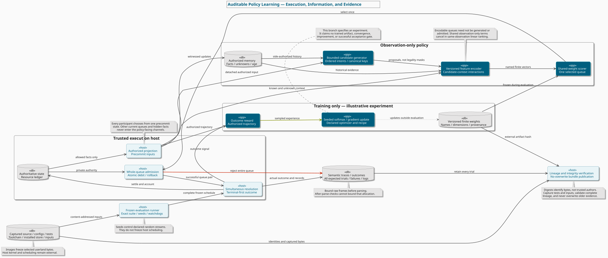

# Auditable Policy Learning

*Abstract:* A study guide for building an outcome-driven policy without confusing valid execution, useful features, learned behavior, and evaluation evidence.
*URL:* [Policy Gradient Methods for Reinforcement Learning with Function Approximation](https://papers.nips.cc/paper/1713-policy-gradient-methods-for-reinforcement-learning-with-function-approximation), [Deep Reinforcement Learning that Matters](https://arxiv.org/abs/1709.06560v3).

**Audience:** readers who understand state machines, resource accounting, basic probability, and vectors.
**Learning objectives:** enforce execution authority, protect information boundaries, define trainable representations, and audit finite evaluation claims.

The contracts below describe a teaching architecture. The learning recipe is an illustrative experiment, not a completed training run or a performance result. Platform documentation supports the named platform behaviors; it does not prove an application's integrity.



[Diagram source](6-post-training/auditable-policy-learning.puml) · [Capability ladder](README.md) · [Authoring conventions](../CONTRIBUTING.md)

Use the [decision workbook](auditable-policy-learning-decisions.md) to compare ownership, quota, provenance, optimizer, curriculum, supervision, and publication options with their evidence obligations.

## Execution contract: a policy proposes; the host authorizes

Keep the authoritative state and resource ledger outside the policy. The policy returns an ordered sequence of intents, not a replacement state or a trusted debit amount.

```text
observe(state, principal, authorizedHistory) -> observation
propose(observation)                        -> ordered candidates
choose(observation, candidates, artifact)   -> one candidate
admit(openState, resourceLedger, candidate) -> accepted queue | rejection
resolve(committedQueues)                    -> nextState, actualOutcome
```

Stage the entire queue privately. Check every action and the complete resource vector before publishing any mutation. One failure rejects the whole queue and rolls back every debit. A helper that clamps an insufficient balance to zero is accounting behavior, not proof of affordability.

For simultaneous decisions, derive every participant's input from the same precommit state. Validate independently, then merge in a pinned order with fresh host-assigned sequence numbers. Stable merge order does not authorize the later participant to observe an earlier participant's current intents or spend.

**Strict recorded-input exercise:** consume external intents by decision-window ordinal. Auxiliary settlement events need not consume a decision window. Preserve order and timing. An explicit empty queue differs from missing data. Check authoritative terminal state before requesting another queue. Exhaustion before a terminal outcome fails the case. Never reset a diverging state to a later historical snapshot or discard an illegal suffix to preserve a favorable score.

Admission and effect are different. An admitted action can be frustrated during resolution. An actor already absent when the next queue is submitted can instead cause an admission rejection.

## Information boundary: unknown is not false

Use a structured, allowlisted observation rather than a partially erased full-state serialization.

| Knowledge | Encoding and interpretation |
|---|---|
| Current known fact | Value plus its authorized scope |
| Confirmed absence | Explicit known-empty or known-false value |
| Unknown fact | Unknown tag or mask; not a guessed zero |
| Historical observation | Separate remembered value and observation age |
| Unavailable private fact | Omitted from the interface |

Memory must derive from authorized evidence. A stale location sighting is not a current occupant or a unique asset identifier. Private resource totals and hidden material changes cannot become authorized merely because a host stores them in a participant-indexed object.

Test the **whole policy channel**, not only its observation fields. Hidden facts can leak through candidate membership, ordering, heuristic scores, feature vectors, or legality masks.

```text
same authorized history + same policy RNG stream
    => same memory, candidates, keys, ordering, features, and decision
```

Vary hidden state, other participants' private queues and resources, future recorded inputs, and record metadata while keeping authorized history equal. Add a positive control where genuinely visible evidence changes. Do not use repeated admission queries against the actual hidden state to choose a replacement candidate.

## Feature contract: support, coverage, and expressiveness differ

Version the action grammar, candidate generator, canonical keys, comparator, feature names, dimensions, and scales separately. A decoder should reject unsupported versions, extra fields, sparse sequences, invalid numbers, contradictory facts, and oversized inputs. Return detached immutable values after validation.

Distinguish three questions:

1. **Representability:** can the codec preserve a reference queue without losing intent fields?
2. **Generator coverage:** does the actual candidate set contain that queue?
3. **Admission:** will the selected queue pass the authoritative host checks?

Complete representability answers neither of the other questions. Report queue membership and individual-action membership with separate denominators. Stratify unsupported cases by sequence length, action kind, timing, and resource demand.

Composite actions are ordered sequences. Encode relative order and timing without truncation. A bounded generator is a subset of a conceptual action domain, not an exhaustive enumerator. Add interaction features for coordination when additive summaries cannot express it. Sums and position-weighted sums can collide; retain ordered rows for inspection.

For a linear ranker,

$$s_w(h,c)=w^\top\phi_v(h,c),$$

each weight belongs to a named feature, not to a separate lookup entry for every action or trajectory. Rule costs remain fixed. Heuristic scores and human preference coefficients are not learned weights.

Observation-only terms cancel when comparing candidates under the same observation. Even `availableBudget - requestedSpend` is a shared constant minus a candidate cost; alone, it does not create resource-dependent preferences. Use candidate-conditioned interactions, such as budget category × requested spend, and bump the feature version when their meaning changes.

### Economic, positional, and strategic context

Keep **requested spend**, **actual paid investment lost**, and **replacement-value loss** separate. A free upgrade can change replacement value without increasing paid investment. Endowed assets need an explicit investment basis. Exact own-loss accounting requires lineage through relocation and upgrades.

Other participants' confirmed losses can provide lower bounds. Disappearance into an unobserved region does not confirm destruction. Compare like valuations and carry uncertainty; do not compare exact own investment with uncertain replacement value under an unlabeled advantage feature.

Distinguish known-clear attack-line segments from unknown blockers and potential threats from confirmed threats. Use knowledge categories before inventing probabilities. A novelty proxy is not calibrated expected information gain.

Exploration, survival, offense, and tactics can label feature families within one shared scorer. Context-dependent priorities require interactions or an explicitly specified richer model. Attribute each feature once when explaining contributions.

Short-horizon decisions must branch on future authorized observations and independently chosen simultaneous actions. A one-to-three-window forecast needs a versioned belief model, bounded expansion, and separate randomness. It must not read future records or actual hidden state. Only the first selected queue reaches live admission.

## Learning recipe: make the update reproducible

An illustrative episodic experiment uses a stable softmax over the authorized candidate set:

$$\pi_w(c\mid h)=\frac{\exp(s_w(h,c)/\tau)}{\sum_{d\in G_v(h)}\exp(s_w(h,d)/\tau)},\qquad \tau>0.$$

Subtract the maximum logit before exponentiation. Draw candidates from a seeded training stream rather than differentiating through deterministic argmax.

For a terminal-reward exercise, use reward `+1` for authoritative success, `0` for a terminal neutral outcome, and `-1` for failure. Declare how rejection, timeout, and exhaustion map to reward. A failure without an actual outcome cannot acquire success through favorable intermediate metrics.

With an action-independent baseline `b(h_t)` and undiscounted terminal reward `R`, a sampled ascent update is:

$$w\leftarrow w+\alpha\sum_t(R-b(h_t))\nabla_w\log\pi_w(c_t\mid h_t).$$

Specify initialization, learning rate, temperature, baseline construction, optional regularization, seeds, and stopping rule before running the experiment. Verify the gradient on a tiny enumerated example. Record actual optimizer updates and changed weights; fixed manually chosen coefficients do not demonstrate learning.

Freeze an artifact containing exact ordered feature names, finite weights, schema and generator versions, inference tie-breaking, training-data identity, recipe, execution pins, and update history. Store its content hash externally to avoid self-reference. Reject mismatched dimensions, names, versions, and nonfinite scores.

Training observations may include executed outcomes for rewards. The inference policy must not receive trace identities, future actions, or outcome labels as features. A demonstration of one participant's success is not automatically a counterpolicy for another participant.

## Evaluation gate: keep every expected trial visible

Pin the complete suite and schedule before evaluation. Use separate seeded streams for environment, policy, opponent, and training selection. Reset inference state as specified. A seed controls declared randomness; it does not make host interruption or scheduling deterministic.

Evaluate one frozen artifact without updates. Count success only from the authoritative outcome. Record losses, neutral outcomes, rejection, exceptions, timeouts, stalls, exhaustion, and missing results. For `N` expected trials, the denominator stays `N` even when execution fails.

A deliberately strict finite gate can require:

```text
complete scheduled coverage
AND successes == N
AND integrity checks pass
AND fallbackCount == 0
AND artifact remains frozen
AND semantic reruns agree
```

This is a declared exercise threshold, not a universal requirement. Product fallback can be useful, but fallback results cannot certify the frozen learned policy under this gate. Successful random samples cannot replace exhaustive coverage.

Compare normalized state traces, settlement payloads, ledgers, and actual outcomes. Exclude nondeterministic timestamps and generated record identifiers, while retaining meaningful event identity and order. Reexecute evidence rather than trusting success labels.

A training-used regression suite is not held-out generalization evidence. Keep unseen cases and independent runs for broader claims. A perfect result on a finite suite is not a universal guarantee.

## Reproducibility and provenance: freeze more than a seed

Capture raw source, configuration, tests, input data, artifact bytes, toolchain, installed dependencies, and dependency-store contents. Inventory the complete declared source universe, including currently unreachable files. Audit imports and explicit runtime loaders; reject unsupported computed loading rather than silently declaring the graph complete.

For an offline execution exercise, acquire digest-pinned tools and dependencies separately, then prove clean installation with an unchanged lockfile and networking disabled. Run with immutable source/dependencies, non-root identity, bounded resources, and a dedicated output directory. Inspect the actual container configuration and image identity. Container images pin userland; they do not pin the host kernel or scheduler.

Use parent-process deadlines to terminate blocked children and reap them. Bound raw transport frames before deserialization. A check after JSON allocation cannot bound that allocation. Preserve completed evidence on failure and derive counters from accepted records, not a stale progress announcement.

Build a provenance graph linking captured inputs, training activity, frozen artifacts, execution activity, and reports. Hashes establish byte identity under a trusted comparison; they do not authenticate a producer by themselves. A hash without retained bytes is a reference, not a reproducible capture.

Before publishing, validate identities, complete command/artifact inventories, log hashes, and the complete source/test capture. Changes to tests, fixtures, or newly added inputs matter too. Stage the entire bundle, use a no-overwrite publication mechanism, and retain failure diagnostics. Atomic visibility and crash durability require separate filesystem checks.

Even documentation-pointer edits change raw source hashes. Preserve old evidence unchanged, then explicitly revalidate and publish current evidence instead of silently relabeling historical results.

## Exercises and answer rubric

| Exercise | Fixture variation | Expected evidence |
|---|---|---|
| Whole-queue admission | First, middle, or last action fails; one resource is insufficient | No published prefix or debit; exact failure position |
| Recorded inputs | Empty queue, missing queue, terminal event before exhaustion | Empty remains explicit; premature exhaustion fails; terminal stops input requests |
| Information isolation | Same authorized history, different hidden state and private metadata | Identical candidates, scores, features, and decision |
| Simultaneous inputs | One participant spends before the other function is called | Both functions still receive detached precommit inputs |
| Representation limits | Missing candidate; colliding summaries; context-only features | Separate coverage and expressiveness failures; shared terms cancel |
| Economic accounting | Paid acquisition, free upgrade, unseen disappearance | Paid loss differs from replacement loss; uncertainty remains explicit |
| Learning check | Tiny softmax with enumerated expected reward | Analytic gradient agrees with finite differences; update changes weights |
| Finite evaluation | Ten expected trials: nine successes and one timeout | Result is 9/10; strict gate fails |
| Runtime supervision | Synchronous loop, oversized unterminated frame, crash after an accepted record | Parent interrupts or rejects; accepted records and counters survive |
| Evidence import | Altered test, missing log, wrong image, traversal path, concurrent publisher | Reject inconsistent bundles; no partial success marker or overwrite |

For each exercise, identify the invariant, build a counterexample, show the observed outcome, and state the assurance limit. Block acceptance on partial mutation, hidden-information leakage, denominator manipulation, or fabricated provenance. Passing these exercises demonstrates contract checks; learning improvement still requires measured evaluation.

## Primary sources and related reading

- **Williams (1992), Simple statistical gradient-following algorithms for connectionist reinforcement learning.** *Abstract:* Foundational reward-based gradient estimators, including REINFORCE. *URL:* https://doi.org/10.1007/BF00992696.
- **Sutton, McAllester, Singh, and Mansour (1999), Policy Gradient Methods for Reinforcement Learning with Function Approximation.** *Abstract:* Policy parameters updated using gradients of expected reward and approximate advantage estimates. *URL:* https://papers.nips.cc/paper/1713-policy-gradient-methods-for-reinforcement-learning-with-function-approximation.
- **Henderson et al., Deep Reinforcement Learning that Matters, v3 (2019).** *Abstract:* Reproducibility, variability, baseline comparisons, and experimental reporting in reinforcement learning. *URL:* https://arxiv.org/abs/1709.06560v3.
- **W3C, PROV-Overview (2013).** *Abstract:* Entities, activities, derivation, and attribution in interoperable provenance. *URL:* https://www.w3.org/TR/prov-overview/. PROV supplies a vocabulary, not cryptographic authenticity or an application integrity proof.
- **Docker official documentation.** *Abstract:* Immutable image references, container configuration boundaries, and disabled container networking. *URL:* https://docs.docker.com/reference/cli/docker/image/pull/, https://docs.docker.com/engine/security/, https://docs.docker.com/engine/network/drivers/none/.
- **pnpm install documentation.** *Abstract:* Offline store-only installation and frozen-lockfile semantics. *URL:* https://pnpm.io/cli/install. Freeze the actual tool version; current documentation does not identify installed bytes.

Related study-cases: [trajectory data and weight updates](6-post-training/harness-trajectory-flywheel.puml), [reward-based adaptation](6-post-training/reinforcement-fine-tuning-pipeline.puml), and [verifiable reward methods](6-post-training/rl-verifiable-rewards.puml). A verifier's determinism does not establish that its objective captures the intended task.
